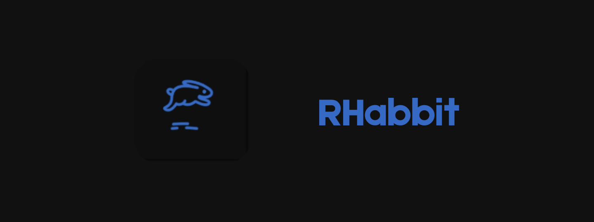
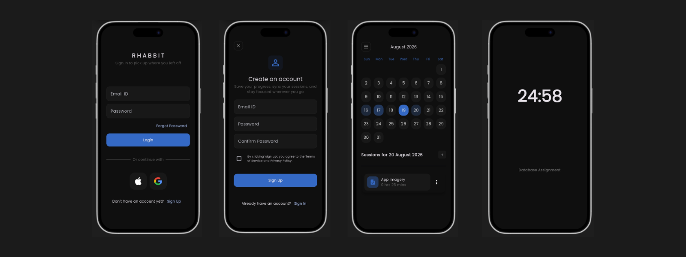
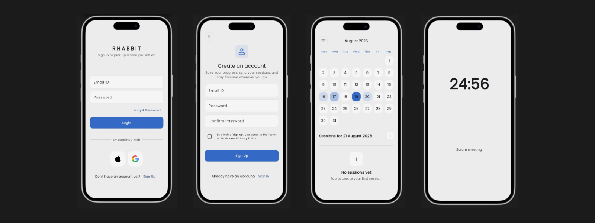

# RHabbit

Complete Flutter productivity / focus tracker type app with authentication, profiles, and focus session analytics.

<p align="center">
  
</P>

## Features

- Authentication (Email, Google Sign-In)
- Focus Sessions
- Heatmap Calendar
- MVVM with Provider State management

## Screenshots

<p align="center">
  
</P>

<p align="center">
  
</P>

## Quick Start

### 1. Clone and install

```bash
git clone https://github.com/ltsatsi/rhabbit.git 
cd rhabit
flutter pub get
```

### 2. Setup Supabase

- Create project at <a href="https://supabase.com/">Supabase Dashboard</a>
- Add your app

### 3. Run

```bash
flutter run
```

## License

This project is licensed under the MIT License - see [LICENSE](LICENSE) file for details.

---

❤️ Created by [Lebogang](https://github.com/ltsatsi)
